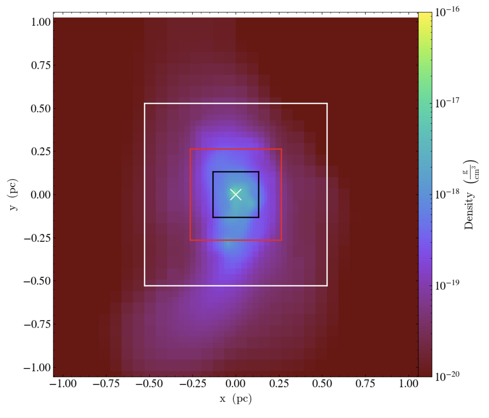
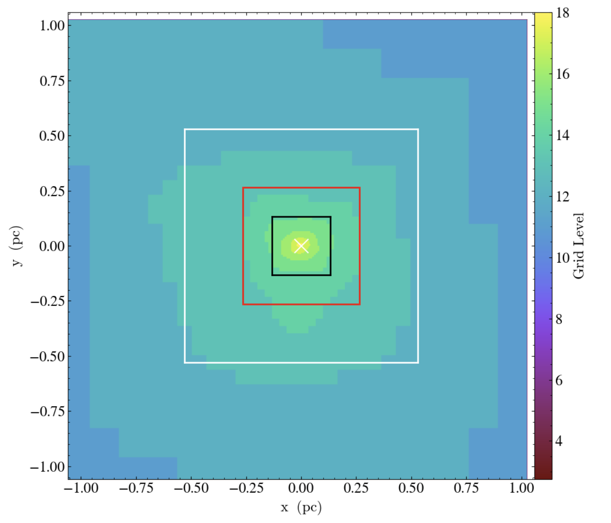

# Folder to extract RAMSES output


RAMSES can restart a simulation directly, taking a previous simulation as initial conditions. The AMR structure is saved in the outputs and such a restart is already implemented in the code. However, in some cases it may be useful to extract only a part of a previous simulation to restart a new one. 


However, there is no provision for directly restarting only part of the simulation in RAMSES. Here, the technique we used is based on the use of GRAPHIC files. It is the format used to initialize cosmological simulations. The advantage is that all the routines for reading them are already implemented in RAMSES. The GRAPHIC format consists of a one-line header and then the value for each cell with a line break. The header gives the level of the grid, the resolution, the offset in the three directions, the expansion factor and the cosmological parameters ($\Omega_m,\, \Omega_l$ and $h_0$). The routine `amr2cube.f90` is used to extract a selected region at a given grid level. Cells more refined than this level are averaged and those less refined are over-sampled. The problem of uniform grids is that when the central region is very refined, it becomes very difficult to extract it with the best possible resolution. We then have to extract at the maximum level of refinement, which over-samples the less refined cells. The extracted region then becomes enormous due to this over-sampling.

## How to extract and restart a simulation with RAMSES ?

In cosmological simulations, it is possible to initialize simulations with different levels of refinement, and I have taken inspiration from this technique to do restarts. The idea is to extract at higher resolution the areas where the grid is more refined. In general, the level of refinement increases concentrically as the gas collapses in the center of the halo. 

I use a simple idea: extract concentric embeded centered cubes, each one at a uniform resolution. Cubes are extracted with higher resolution the smaller they are. As a result, the total memory size of each cube is roughly similar, as the width is smaller for the higher-resolution cube. In this way, off-center areas will be sampled less than central areas, significantly limiting memory usage. Here, the simulation is extracted with four embeded boxes: the whole slice and the white, red and black squares. For each cube, the extracted resolution is equal to the maximum level triggered in the cube that is not sampled with one of the other embeded cubes.

        |  
:----------------------:|:-------------------------:
Density                 |  Level of refinement

*Slice of a cosmological simulation. The cross in the center marks the center of a halo. I extract this simulation with four cubes: the first is the whole slice and the next three are marked by the white, red and black boxes.*

### Extract form the large simulation:

All boxes are extracted with the `amr2cube.f90` routine. It takes as parameters the coordinates of the box and the level at which it is extracted. However, care must be taken with the coordinates to ensure that the various boxes are properly nested: the AMR structure of RAMSES means that only powers of two are possible. The position of the boxes must therefore be rounded to the nearest power of 2. 

Once a GRAPHIC file for each box has been generated, RAMSES needs to read them and create an appropriate AMR structure. First, the header of the GRAPHIC file gives the resolution and the offset of the given file. It needs to be tuned so that RAMSES understands where the differents boxes are situated. This is a bit tricky as RAMSES's header reader is not straitforward to understand. For the extracted simulation of figure \ref{fig:extract}, here are the parameters set in the headers: 


```
# Header of the whole slice cube extracted at level=level_1
    offset_x, offset_y, offset_z = 0, 0, 0
    dx = 1/2**level_0

# Header of the first embeded cube extracted at level=level_1
    offset_x, offset_y, offset_z = 0.5, 0.5, 0.5
    dx = 1/2**level_1

# Header of the second embeded cube extracted at level=level_2
    offset_x, offset_y, offset_z = 1.5, 1.5, 1.5
    dx = 1/2**level_2

# Header of the third embeded cube extracted at level=level_3
    offset_x, offset_y, offset_z = 3.5, 3.5, 3.5
    dx = 1/2**level_3
```


### Run the isolated simulation

Then, RAMSES needs to know which area correponds to each cubes, and thus how it should create the initial AMR strucure. In cosmological zomm-in runs, this is done via a passive scalar which is equal to 1 for area where refinement is needed and 0 elsewhere. Here, we use another way, via the geometrical refinement strategy of RAMSES: in the namelist we specify wich area are the one concerned by the differents boxes. The namelist is modified as follows: 

```
    x_refine = 3*0.5   ! center of the refined region
    y_refine = 3*0.5   ! center of the refined region
    z_refine = 3*0.5   ! center of the refined region
    r_refine = 0.48, 0.23, 0.12 ! radius of the refined region
    exp_refine = 3*15  ! Refined region is a square
    m_refine = 3*0.0   ! To force the geometrical refine directly at the first output
```

Finally, RAMSES has succeeded in building the first output. However, the coarsest level (the level of the largest cube) can be high due to the sampling. The refinement strategy also needs to be updated as the geometrical refinement is no longer needed. To do so, we can then perform a classic restart from the first output, lowering the levelmin to reduce the cost of coarse cells and updating the refinement strategy.


## Description of the folders
- `source/` : The source files of `amr2cube`
- `bin/` : the bin with the Makefile
- `extract_ramses_to_graphic.ipynb` : a notebook describing the recipes
- start.nml : a namelist to start a new simulation
